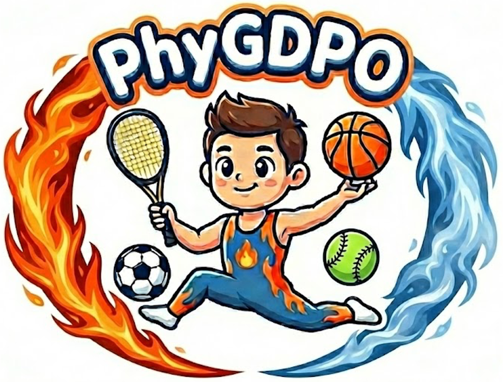
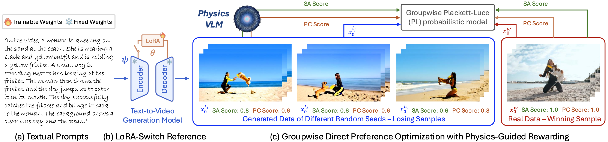
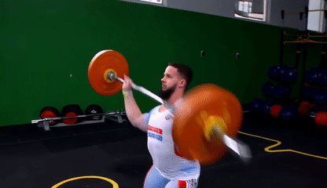
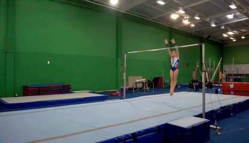
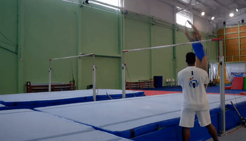

&nbsp;

<div align="center">

<p align="center">  </p>

[](https://zhuanlan.zhihu.com/p/2060200098131350370)
[](https://arxiv.org/abs/2512.24551)
[](https://caiyuanhao1998.github.io/project/PhyGDPO/)
[](https://huggingface.co/datasets/CaiYuanhao/PhyGDPO)
[](https://huggingface.co/CaiYuanhao/PhyGDPO)

<h3>PhyGDPO: Physics-Aware Groupwise Direct Preference <br> Optimization for Physically Consistent Text-to-Video Generation</h3>

</div>

&nbsp;

### Introduction
This part of code implements our Physics-aware Groupwise Direct Preference Optimization framework `PhyGDPO`. We develop our method based on the [Diffsynth-Studio](https://github.com/modelscope/DiffSynth-Studio) codebase, using [Wan2.1-T2V](https://github.com/Wan-Video/Wan2.1) as the base text-to-video generation model. Please refer to the official [github repo](https://github.com/modelscope/DiffSynth-Studio) of Diffsynth-Studio for more details.

<p align="center">
  
</p>

<p align="center"><strong>Figure 2:</strong> The Overview of our Physics-aware Groupwise Direct Preference Optimization framework</p>


&nbsp;
&nbsp;


## 1. Environment Installation
We recommand you use conda to install the environment
```sh
conda create -n phygdpo python=3.11 -y
conda activate phygdpo
python -m pip install -e .
bash install_extra_packages.sh
```


&nbsp;

## 2. Inference

Please firstly download the [Wan2.1-T2V-1.3B](https://huggingface.co/Wan-AI/Wan2.1-T2V-1.3B) and [Wan2.1-T2V-14B](https://huggingface.co/Wan-AI/Wan2.1-T2V-14B) base models from their official HuggingFace website as

```sh
git lfs install
git clone https://huggingface.co/Wan-AI/Wan2.1-T2V-1.3B
git clone https://huggingface.co/Wan-AI/Wan2.1-T2V-14B
```
Then place the two models under `models/Wan-AI/`, or pass an absolute checkpoint
path with `--model_dir`. Keeping checkpoints outside Git is recommended.

Please download our LoRA models from our Google Drive or Hugging Face website

```sh
git clone https://huggingface.co/CaiYuanhao/PhyGDPO
```

Place our models into the folder `models/pretrained` as

```sh
|--models
  |--pretrained
    |--Wan2.1-T2V-1.3B_PhyGDPO
    |--Wan2.1-T2V-14B_PhyGDPO
```

For your convenience to make a comparison, we also provide the tensor parallel version code to run the base model.

(1) Run 1.3B models

```sh
# 1.3B Base Model
CUDA_VISIBLE_DEVICES=0,1,2,3 torchrun --standalone --nproc_per_node=4 \
  examples/wanvideo/wan_1.3B_tensor_parallel.py \
  --model_dir /path/to/Wan2.1-T2V-1.3B \
  --output_path outputs/weightlifting_1.3B.mp4

# 1.3B Model using our PhyGDPO post-training
CUDA_VISIBLE_DEVICES=0,1,2,3 torchrun --standalone --nproc_per_node=4 \
  examples/wanvideo/model_training/validate_lora/Wan2.1-T2V-1.3B_tensor_parallel_PhyGDPO.py \
  --model_dir /path/to/Wan2.1-T2V-1.3B \
  --lora_path /path/to/Wan2.1-T2V-1.3B_PhyGDPO/epoch-0.safetensors \
  --output_folder outputs
```

Then you will see the following comparison

<p align="center">
<table border="0" cellspacing="0" cellpadding="0" style="border-collapse:collapse;border:0;">

  <!-- ===== Row 1 Prompt ===== -->
  <tr>
    <td colspan="2" align="center" style="border:0;padding:6px 10px;font-style:italic;">
      A weightlifter successfully completes a snatch with a 25kg barbell, holding it momentarily overhead.
    </td>
  </tr>
  <tr>
    <td style="border:0;padding:10px;">
      
    </td>
    <td style="border:0;padding:10px;">
      
    </td>
  </tr>
  <tr>
    <td align="center" style="border:0;padding-top:6px;font-weight:700;">Wan2.1-T2V-1.3B w/o PhyGDPO</td>
    <td align="center" style="border:0;padding-top:6px;font-weight:700;">Wan2.1-T2V-14B with PhyGDPO</td>
  </tr>
</table>
</p>


(2) Run 14B models

```sh
# 14B Base Model
torchrun --standalone --nproc_per_node=8 examples/wanvideo/wan_14B_tensor_parallel.py

# 14B Model using our PhyGDPO post-training
torchrun --standalone --nproc_per_node=8 examples/wanvideo/model_training/validate_lora/Wan2.1-T2V-14B_tensor_parallel_PhyGDPO.py --lora_path models/pretrained/Wan2.1-T2V-14B_PhyGDPO/step-0001000.safetensors
```

Then you will see the following comparison

<p align="center">
<table border="0" cellspacing="0" cellpadding="0" style="border-collapse:collapse;border:0;">

  <!-- ===== Row 1 Prompt ===== -->
  <tr>
    <td colspan="2" align="center" style="border:0;padding:6px 10px;font-style:italic;">
      A gymnast drops from the parallel bars and lands safely on the mat below.
    </td>
  </tr>
  <tr>
    <td style="border:0;padding:10px;">
      
    </td>
    <td style="border:0;padding:10px;">
      
    </td>
  </tr>
  <tr>
    <td align="center" style="border:0;padding-top:6px;font-weight:700;">Wan2.1-T2V-14B w/o PhyGDPO</td>
    <td align="center" style="border:0;padding-top:6px;font-weight:700;">Wan2.1-T2V-14B with PhyGDPO</td>
  </tr>
</table>
</p>


`Note:` The 1.3B tensor-parallel layout supports 1, 2, 4, or 8 visible GPUs;
`--nproc_per_node` must equal the number of devices in `CUDA_VISIBLE_DEVICES`.
Six-way sharding is invalid because the 8960-wide FFN cannot be evenly
partitioned. For accurate and fast testing, we recommend using H100 GPUs for
inference. The base checkpoint occupies about 17 GB on disk.

&nbsp;

## 3. Training

Before training with our PhyGDPO, you need to download our DPO losing cases generated by the original Wan2.1-T2V models and their physical scores. Unzip and place the downloaded data from our HuggingFace page into the folder `PhyGDPO/PhyAugPipe/DPO_data` and `PhyGDPO/DiffSynth-Studio/json_file` with the following structure

```sh
|--PhyGDPO
  |--PhyAugPipe
    |--DPO_data
      |-- Wan1.3B
      |-- Wan14B
  |--DiffSynth-Studio
    |--json_file
```

Please go to the folder `PhyAugPipe` for detailed instruction to prepare the training data.

Then run

```sh
# Single node training with 1.3B model
. train_1.3B.sh

# Single node training with 14B model
. train_14B.sh
```

`Note:` Due to storage limitations, we are only able to upload a subset of the DPO losing cases. In particular, for the Wan2.1-T2V-1.3B model, only 1,000 samples are provided. To achieve better performance, we recommend using our code to construct a larger set of losing cases. We write a data parallel version to speed up this process

```sh
# Generating losing cases for 1.3B model
. test_dpo_losing_case_1.3B.sh

# Generating losing cases for 14B model
. test_dpo_losing_case_14B.sh
```

&nbsp;


## 4. Citation

```sh
@inproceedings{phygdpo,
  title={PhyGDPO: Physics-Aware Groupwise Direct Preference Optimization for Physically Consistent Text-to-Video Generation},
  author={Cai, Yuanhao and Li, Kunpeng and Jia, Menglin and Wang, Jialiang and Sun, Junzhe and Liang, Feng and Chen, Weifeng and Juefei-Xu, Felix and Wang, Chu and Thabet, Ali and Dai, Xiaoliang and Ju, Xuan and Yuille, Alan and Hou, Ji},
  booktitle={ECCV},
  year={2026}
}
```
