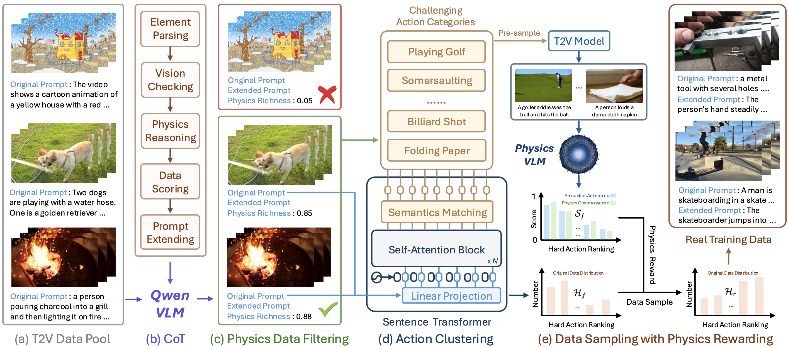

&nbsp;

<div align="center">

<p align="center">  </p>

[](https://arxiv.org/abs/2512.24551)
[](https://caiyuanhao1998.github.io/project/PhyGDPO/)
[](https://huggingface.co/datasets/CaiYuanhao/PhyGDPO)
[](https://huggingface.co/CaiYuanhao/PhyGDPO)

<h3>PhyGDPO: Physics-Aware Groupwise Direct Preference <br> Optimization for Physically Consistent Text-to-Video Generation</h3> 

</div>

&nbsp;

### Introduction
This part of code implements our data construction method `PhyAugPipe`. In this part, we first use [DeepSeek-R1-Distill-Llama-70B](https://huggingface.co/deepseek-ai/DeepSeek-R1-Distill-Llama-70B) to process and reason the text prompts. Then for the physics data filtering, our implementation contain two versions, the first version uses the open-sourced VLM model [Qwen2.5-VL-72B-Instruct](https://huggingface.co/Qwen/Qwen2.5-VL-72B-Instruct) and the second version adopts the closed-source model Gemini-pro. For the rewarding, we adopt the physics-aware VLM [VideoCon-Physics](https://huggingface.co/videophysics/videophy_2_auto) to score the videos.

<p align="center">
  
</p>

<p align="center"><strong>Figure 2:</strong> The Overview of our Physics-Augmented Video Data Construction Pipeline</p>


&nbsp;
&nbsp;


## 1. Environment Installation
We recommand you use conda to install the environment
```sh
conda create -n phyaugpipe python=3.11 -y
conda activate phyaugpipe
python -m pip install -r requirement.txt
conda install -c conda-forge ffmpeg
```


&nbsp;

## 2. Data and Model Preparation
We adopt VidGen-1M as the original text-video data pool. The complete download is
approximately 2 TiB, so check free disk space before starting. Please download the dataset from its [hugging face page](https://huggingface.co/datasets/Fudan-FUXI/VIDGEN-1M) as

```sh
git lfs install
git clone https://huggingface.co/datasets/Fudan-FUXI/VIDGEN-1M
```


Then unzip the videos, divide the `VidGen_1M_video_caption.json` into 8 equal parts as from `VidGen_1M_video_caption_0.json` to `VidGen_1M_video_caption_7.json`, origanize the files, and move them into the folder `T2V_data` as

```sh
|--T2V_data
    |--VIDGEN-1M
      |-- VidGen_1M_video_caption.json
      |-- VidGen_1M_video_caption_0.json
      |-- VidGen_1M_video_caption_1.json
      |-- ...
      |-- VidGen_1M_video_caption_7.json
      |-- VidGen_video_0.zip
      |-- VidGen_video_1.zip
      |-- ...
      |-- VidGen_video_2047.zip
    |--VIDGEN-1M_unzip
      |-- NjDCwU95uGM-Scene-0013.mp4
      |-- eK1N96Zwt-U-Scene-0013.mp4
      |-- x8qD1uU7Hng-Scene-0009.mp4
      |-- y8IQw4dn-JE-Scene-0056.mp4
      |-- zt1GLX-vGl4-Scene-0077.mp4
      |-- ...
```

Please also download the three open-source VLM models we use for data construction as

```sh
# VideoCon-Physics
git clone https://huggingface.co/videophysics/videophy_2_auto/

# Qwen2.5
git clone https://huggingface.co/Qwen/Qwen2.5-VL-72B-Instruct

# DeepSeek-R1
git clone https://huggingface.co/deepseek-ai/DeepSeek-R1-Distill-Llama-70B
```

Then place them into the folder `models` as

```sh
|--models
  |--DeepSeek-R1-Distill-Llama-70B
  |--Qwen2.5-VL-72B-Instruct
  |--videophy_2_auto
```

&nbsp;

## 3. Physicsl Data Filtering with Chain-of-Thoughts (CoT) prompt

### 3.1 Use DeepSeek-R1-Distill-Llama-70B to preprocess

For your convenience, we provide all processed json files and DPO losing cases in the huggingface, which can be used for direct T2V model training. Please feel free to check and download as

```sh
git clone https://huggingface.co/datasets/CaiYuanhao/PhyGDPO
```

Here we introduce how we construct the data. We first use the DeepSeek model to pre-process and reason the text prompts. The following code is data parallel with multiple independent requests processed concurrently, which significantly improves throughput by overlapping token generation and fully utilizing GPU resources. I suggest you to run the following 8 commonds on 8 nodes of A100/H100 or more advanced GPU with at least 80G memory.

```sh
# Data Parallel
. prompts_filter_deepseek.sh 0
. prompts_filter_deepseek.sh 1
. prompts_filter_deepseek.sh 2
. prompts_filter_deepseek.sh 3
. prompts_filter_deepseek.sh 4
. prompts_filter_deepseek.sh 5
. prompts_filter_deepseek.sh 6
. prompts_filter_deepseek.sh 7
```

The processed json files are output into the folder `processed_json`

`Note:` For physics data filtering, we provide two verisions. The first version uses the free open-source model Qwen2.5-VL-72B-Instruct while the second version adopts the closed-source model Gemini-1.5-pro, which performs much better than Qwen. Please make your choice. 

We already provide the data filtered by Gemini-1.5-pro and Qwen2.5-VL-72B-Instruct for your convenience to quick start. Please download it from our [huggingface website](https://huggingface.co/datasets/CaiYuanhao/PhyGDPO).

### 3.2 Option-1: Use Gemini-pro

We previously processed the text–video data pairs using `Gemini-1.5-pro`, which has now been deprecated by Google. Accordingly, we have updated our implementation to call `Gemini-2.5-pro`. Prior to running the code, users must obtain a `Google AI API key` from [this website](https://aistudio.google.com/api-keys) and export it as `GOOGLE_API_KEY` before running `prompts_filter_gemini.sh`. To mitigate potential issues caused by future model updates or deprecations, we explicitly enumerate all currently available models in the codebase for selection.

```sh
# Data Parallel
. prompts_filter_gemini.sh 0
. prompts_filter_gemini.sh 1
. prompts_filter_gemini.sh 2
. prompts_filter_gemini.sh 3
. prompts_filter_gemini.sh 4
. prompts_filter_gemini.sh 5
. prompts_filter_gemini.sh 6
. prompts_filter_gemini.sh 7
```

### 3.2 Option-2: Use Qwen2.5-VL-72B-Instruct

We understand using Gemini-pro costs a lot. To help your research without this expense, we develop another version using the free open-source model `Qwen2.5-VL-72B-Instruct`. Our code can be easily adapted to use more advanced models, such as `Qwen3`. The following code is data parallel with multiple independent requests processed concurrently, which significantly improves throughput by overlapping token generation and fully utilizing GPU resources. I suggest you to run the following 8 commonds on 8 nodes of A100/H100 or more advanced GPU with at least 80G memory.

```sh
# Data Parallel
. prompts_filter_qwen.sh 0
. prompts_filter_qwen.sh 1
. prompts_filter_qwen.sh 2
. prompts_filter_qwen.sh 3
. prompts_filter_qwen.sh 4
. prompts_filter_qwen.sh 5
. prompts_filter_qwen.sh 6
. prompts_filter_qwen.sh 7
```

&nbsp;


## 4. Generating Videos as Losing Cases

After physics data filtering, you can pick up a list of videos from the filtered data. Then use the pre-trained T2V model Wan2.1-T2V-14B to generate 3 videos with 3 random seeds for each text prompt in the pick-up set. For your convenience to quick start, we provide the generated losing cases in our huggingface website. Please feel free to download. If you want to generate the losing cases yourself, we also provide a data-parallel version code to do this in the folder [`PhyGDPO/DiffSynth-Studio`](https://github.com/caiyuanhao1998/PhyGDPO/tree/master/DiffSynth-Studio), please go to the folder and check the `README.md` file for detailed instruction. The generated DPO losing video cases are organized as

```sh
|--DPO_data
  |--Wan1.3B
    |--seed_0
      |-- __1tDwG_iAE-Scene-0003.mp4
      |-- __1tDwG_iAE-Scene-0003.txt
      |-- __bW5-u4k9Q-Scene-0014.mp4
      |-- __bW5-u4k9Q-Scene-0014.txt
      |-- ...
    |--seed_1
      |-- __1tDwG_iAE-Scene-0003.mp4
      |-- __1tDwG_iAE-Scene-0003.txt
      |-- __bW5-u4k9Q-Scene-0014.mp4
      |-- __bW5-u4k9Q-Scene-0014.txt
      |-- ...
    |--seed_3
      |-- __1tDwG_iAE-Scene-0003.mp4
      |-- __1tDwG_iAE-Scene-0003.txt
      |-- __bW5-u4k9Q-Scene-0014.mp4
      |-- __bW5-u4k9Q-Scene-0014.txt
      |-- ...
  |--Wan14B
    |--seed_0
      |-- __1tDwG_iAE-Scene-0003.mp4
      |-- __1tDwG_iAE-Scene-0003.txt
      |-- __bW5-u4k9Q-Scene-0014.mp4
      |-- __bW5-u4k9Q-Scene-0014.txt
      |-- ...
    |--seed_1
      |-- __1tDwG_iAE-Scene-0003.mp4
      |-- __1tDwG_iAE-Scene-0003.txt
      |-- __bW5-u4k9Q-Scene-0014.mp4
      |-- __bW5-u4k9Q-Scene-0014.txt
      |-- ...
    |--seed_3
      |-- __1tDwG_iAE-Scene-0003.mp4
      |-- __1tDwG_iAE-Scene-0003.txt
      |-- __bW5-u4k9Q-Scene-0014.mp4
      |-- __bW5-u4k9Q-Scene-0014.txt
      |-- ...
```
where the txt file is the original text prompt.

&nbsp;


## 5. Physics-Guided Rewarding
To evaluate the physics plausibility of the generated videos, we use the physics-aware VLM VideoCon-Physics to score the videos. Each video is evaluated with two socres: semantics adherence (SA) and physics commonsense (PC). We write a data parallel code to speed up this process, please enter the folder [`videophy`](https://github.com/caiyuanhao1998/PhyGDPO/tree/master/PhyAugPipe/videophy) for detailed instruction to install the environment and run the code.

For your convenience, we also provide the processed csv files organized as
```sh
|--videophy
  |--evaluated_score
    |--train_part_0_1.3B_seed_0
      |--final.csv
    |--train_part_0_1.3B_seed_1
      |--final.csv
    |--train_part_0_1.3B_seed_3
      |--final.csv
    |--train_part_0_14B_seed_0
      |--final.csv
    |--train_part_0_14B_seed_1
      |--final.csv
    |--train_part_0_14B_seed_3
      |--final.csv
```

Each csv file has the following format:
```sh
videopath,caption,orig_idx,sa_score,pc_score,joint_score
/data/home/.../seed_0/--492-xoMZ0-Scene-0018.mp4,"The video shows a close-up of a black pan with various spices and seeds scattered on it. The spices include star anise, cinnamon sticks, and cardamom pods. The seeds are likely coriander or cumin. The spices and seeds are being stirred with a spatula by a person's hand, which is visible in the frame. The colors of the spices and seeds are brown and beige, and they contrast with the black color of the pan. The spices and seeds are being mixed together, and the person's hand is moving them around the pan.",--492-xoMZ0-Scene-0018,1,4,0
/data/home/.../seed_0/--98VRFpvEQ-Scene-0026.mp4,"In the video, a person is seen preparing a piece of meat. The meat is placed on a white paper towel on a wooden countertop. The person then proceeds to wrap the meat in plastic wrap and press it down to ensure it is tightly sealed. The person's hands are visible, but the rest of their body is not shown in the video. The meat appears to be raw and is of a light pink color. The plastic wrap is clear and the person uses their hands to press down on the wrap to ensure it is tightly sealed. The wooden countertop is light brown and appears to be clean and well-maintained.",--98VRFpvEQ-Scene-0026,5,5,1
/data/home/.../seed_0/--JgH7OLFO8-Scene-0148.mp4,"In the video, a person is seen holding a small alligator in their hand. The alligator is struggling to get away, but the person is holding it firmly. The person then releases the alligator, and it quickly runs away into the water. The video is shot in a dark environment, and the alligator is the only visible object. The person's hand is visible, and they are wearing a watch on their wrist. The alligator is brown and has a rough texture. The water appears to be shallow, and there are some plants visible in the background.",--JgH7OLFO8-Scene-0148,1,5,0
...
```


&nbsp;

## 5. Citation
```sh
@inproceedings{phygdpo,
  title={PhyGDPO: Physics-Aware Groupwise Direct Preference Optimization for Physically Consistent Text-to-Video Generation},
  author={Cai, Yuanhao and Li, Kunpeng and Jia, Menglin and Wang, Jialiang and Sun, Junzhe and Liang, Feng and Chen, Weifeng and Juefei-Xu, Felix and Wang, Chu and Thabet, Ali and Dai, Xiaoliang and Ju, Xuan and Yuille, Alan and Hou, Ji},
  booktitle={ECCV},
  year={2026}
}
```
