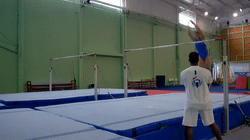
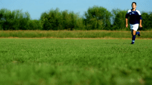
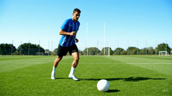
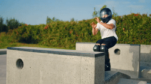
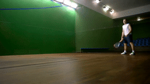

&nbsp;

  

<h3>PhyGDPO: Physics-Aware Groupwise Direct Preference   Optimization for Physically Consistent Text-to-Video Generation</h3> 

<table border="0" cellspacing="0" cellpadding="0" style="border-collapse:collapse;border:0;">

  <!-- ===== Row 1 Prompt ===== -->
  <tr>
    <td colspan="3" align="center" style="border:0;padding:6px 10px;font-style:italic;">
      (1) A gymnast drops from the parallel bars and lands safely on the mat below.
    </td>
  </tr>
  <tr>
    <td style="border:0;padding:10px;">
      
    </td>
    <td style="border:0;padding:10px;">
      
    </td>
    <td style="border:0;padding:10px;">
      
    </td>
  </tr>

  <tr>
    <td align="center" style="border:0;padding-top:6px;font-weight:700;">Ours</td>
    <td align="center" style="border:0;padding-top:6px;font-weight:700;">OpenAI Sora2</td>
    <td align="center" style="border:0;padding-top:6px;font-weight:700;">Google Veo3.1</td>
  </tr>

  <!-- ===== Row 2 Prompt ===== -->
  <tr>
    <td colspan="3" align="center" style="border:0;padding:6px 10px;font-style:italic;">
      (2) A soccer player runs, plants their foot, and drop kicks a soccer ball high into the air, the ball arcing visibly.
    </td>
  </tr>
  <tr>
    <td style="border:0;padding:10px;">
      
    </td>
    <td style="border:0;padding:10px;">
      
    </td>
    <td style="border:0;padding:10px;">
      
    </td>
  </tr>

  <tr>
    <td align="center" style="border:0;padding-top:6px;font-weight:700;">Ours</td>
    <td align="center" style="border:0;padding-top:6px;font-weight:700;">OpenAI Sora2</td>
    <td align="center" style="border:0;padding-top:6px;font-weight:700;">Google Veo3.1</td>
  </tr>

  <!-- ===== Row 3 Prompt ===== -->
  <tr>
    <td colspan="3" align="center" style="border:0;padding:6px 10px;font-style:italic;">
      (3) A person wearing a helmet performs a handspring over a platform.
    </td>
  </tr>
  <tr>
    <td style="border:0;padding:10px;">
      
    </td>
    <td style="border:0;padding:10px;">
      
    </td>
    <td style="border:0;padding:10px;">
      
    </td>
  </tr>

  <tr>
    <td align="center" style="border:0;padding-top:6px;font-weight:700;">Ours</td>
    <td align="center" style="border:0;padding-top:6px;font-weight:700;">OpenAI Sora2</td>
    <td align="center" style="border:0;padding-top:6px;font-weight:700;">Google Veo3.1</td>
  </tr>

  <!-- ===== Row 4 Prompt ===== -->
  <tr>
    <td colspan="3" align="center" style="border:0;padding:6px 10px;font-style:italic;">
      (4) A person plays squash on an indoor court.
    </td>
  </tr>
  <tr>
    <td style="border:0;padding:10px;">
      
    </td>
    <td style="border:0;padding:10px;">
      
    </td>
    <td style="border:0;padding:10px;">
      
    </td>
  </tr>

  <!-- ===== Method Labels ===== -->
  <tr>
    <td align="center" style="border:0;padding-top:6px;font-weight:700;">Ours</td>
    <td align="center" style="border:0;padding-top:6px;font-weight:700;">OpenAI Sora2</td>
    <td align="center" style="border:0;padding-top:6px;font-weight:700;">Google Veo3.1</td>
  </tr>

</table>

&nbsp;

### Introduction
This is a re-implementation of our work "PhyGDPO: Physics-Aware Groupwise Direct Preference Optimization for Physically Consistent Text-to-Video Generation" using public datasets and re-trained model based on public codes. In this work, we present a data construction pipeline, PhyAugPipe, that can create data pairs and a new direct preference optimization framework, PhyGDPO, for physically plausile text-to-video generation. If you find our repo useful, please give it a star ⭐ and consider citing our paper. Thank you :)

&nbsp;

  

<strong>Figure 1:</strong> Our data construction pipeline

&nbsp;

  

<strong>Figure 2:</strong> The overall framework of our OmniVCus

### News
- **2025.12.31 :** Our paper is on [arxiv](https://arxiv.org/abs/2512.24551) now. 🚀
- **2025.12.31 :** Our [project page](https://caiyuanhao1998.github.io/project/PhyGDPO/) has been built up. Feel free to check the video generation results on the project page.

